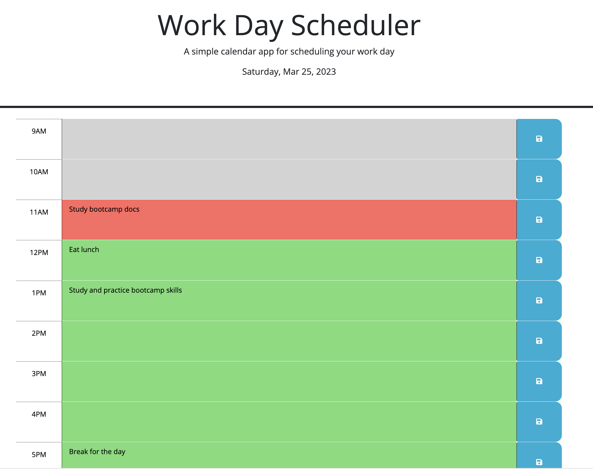

# daily-planner
App for a daily planner that allows custom user input for events

A simple calendar application that allows the user to save events for each hour of the day. This app runs in the browser and feature dynamically updated HTML and CSS, powered by jQuery.

# Webpage

Link to Deployed Application;
https://tasshroll.github.io/daily-planner

Link to GitHub repository:
https://github.com/tasshroll/daily-planner

# Screenshot
SCREENSHOTS of application

VIDEO of usage

## Description
This Application generates simple daily calendar for the times blocks of 9AM to 5PM. The userr can save save events for each hour of the day. The user data is storerd in local storage and retained when the page is refreshed. The application will update the date and hour each minute. Time blocks in the past are colored grey, the current time block is red, and future time blocks are green.

This app runs in the browser and feature dynamically updated HTML and CSS, powered by jQuery.

## User Story
AS AN employee with a busy schedule
I WANT to add important events to a daily planner
SO THAT I can manage my time effectively

## Acceptance Criteria
GIVEN I am using a daily planner to create a schedule
WHEN I open the planner
THEN the current day is displayed at the top of the calendar
WHEN I scroll down
THEN I am presented with timeblocks for standard business hours
WHEN I view the timeblocks for that day
THEN each timeblock is color coded to indicate whether it is in the past, present, or future
WHEN I click into a timeblock
THEN I can enter an event
WHEN I click the save button for that timeblock
THEN the text for that event is saved in local storage
WHEN I refresh the page
THEN the saved events persist

## Other

- What was your motivation and what did you learn? 
Motivated to build an application that:
Uses DOM traversal to locate target data and render output to the correct HTML element.
Stores and retrieves data using the browser's local and session storage. (did not use JSON parse & stringify)
Uses time interval to update the hour and colored time blocks continuously.

- What did you learn?
I learned the process of app development: Analyze the mockup, complete the to do's, test sections by writing out data to the console, refactor, and document. I learned more about local storage.

## Installation 
N/A

## Usage
Click the main Generate Password button and answer the prompts.

## Credits
N/A
Ask BCS

## License
Please refer to the LICENSE in the repo.

## Badges
N/A

## Features
N/A

## How to Contribute
N/A

## Tests
N/A

